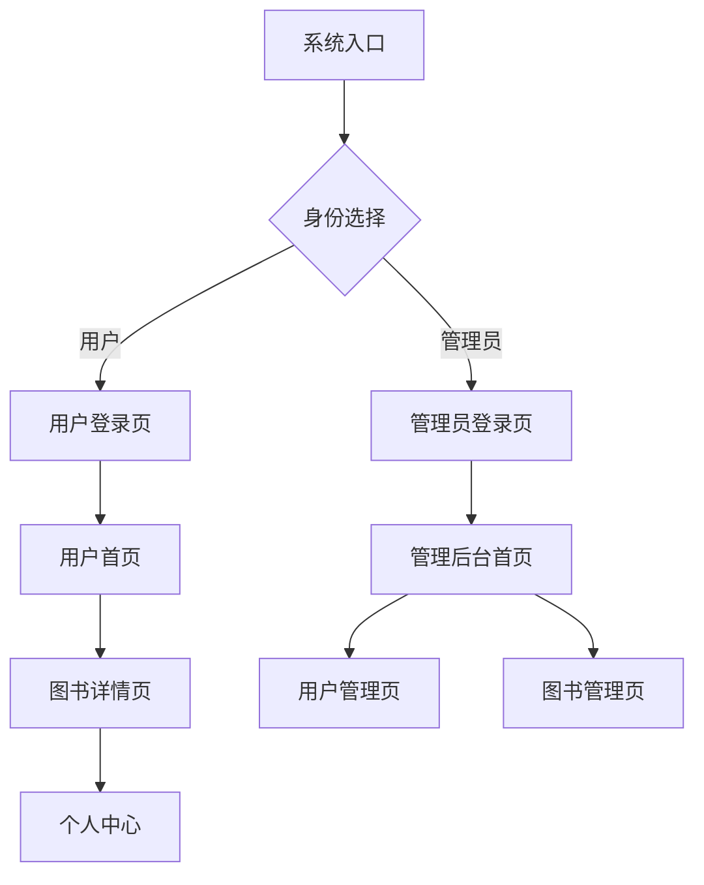

## 1. 产品概述
基于知识图谱和LLM的智能图书推荐系统，为读者提供个性化阅读体验，为管理员提供高效的内容管理平台。
- 解决传统图书推荐精准度低的问题，通过AI技术提升推荐质量
- 面向图书爱好者和管理人员，提供分离的用户体验
- 目标市场：数字阅读平台、图书馆管理系统、在线书城

## 2. 核心功能

### 2.1 用户角色
| 角色 | 注册方式 | 核心权限 |
|------|----------|----------|
| 普通用户 | 邮箱/手机号注册 | 浏览图书、阅读内容、收藏推荐、个人中心 |
| 管理员 | 后台创建账号 | 用户管理、图书管理、数据统计、系统设置 |

### 2.2 功能模块
系统包含以下主要页面：
1. **用户登录页**：用户身份验证入口
2. **管理员登录页**：管理员专用登录界面
3. **用户首页**：推荐图书展示、分类浏览
4. **图书详情页**：图书信息、在线阅读、推荐相关
5. **个人中心**：收藏夹、阅读历史、个人设置
6. **管理后台首页**：数据统计概览
7. **用户管理页**：用户列表、权限管理
8. **图书管理页**：图书CRUD操作、分类管理

### 2.3 页面详情
| 页面名称 | 模块名称 | 功能描述 |
|----------|----------|----------|
| 用户登录页 | 登录表单 | 输入用户名密码，支持记住密码，跳转注册 |
| 管理员登录页 | 管理员登录 | 独立URL入口，管理员账号验证 |
| 用户首页 | 推荐模块 | 基于AI算法展示个性化推荐图书 |
| 用户首页 | 分类浏览 | 按类别展示图书，支持筛选排序 |
| 图书详情页 | 图书信息 | 展示封面、简介、作者、评分等详情 |
| 图书详情页 | 在线阅读 | 提供图书内容阅读界面 |
| 图书详情页 | 相关推荐 | 基于知识图谱推荐相似图书 |
| 个人中心 | 收藏夹 | 管理用户收藏的图书 |
| 个人中心 | 阅读历史 | 查看阅读记录和进度 |
| 管理后台首页 | 数据统计 | 展示用户量、图书量、活跃度等核心指标 |
| 用户管理页 | 用户列表 | 查看、编辑、禁用用户账号 |
| 图书管理页 | 图书列表 | 添加、编辑、删除图书信息 |
| 图书管理页 | 分类管理 | 维护图书分类体系 |

## 3. 核心流程
### 用户流程
用户访问系统 → 用户登录页 → 验证成功 → 用户首页浏览推荐 → 点击图书查看详情 → 在线阅读/收藏 → 个人中心管理

### 管理员流程
访问管理员登录页 → 管理员验证 → 管理后台首页 → 用户管理/图书管理 → 执行管理操作

## 4. 用户界面设计

### 4.1 设计风格
- **主色调**：蓝色系（#2563eb）为主，白色背景，灰色辅助
- **按钮样式**：圆角矩形，悬停效果，主要操作为实心按钮
- **字体**：系统默认字体，标题18-24px，正文14-16px
- **布局风格**：用户端采用顶部导航+卡片式布局，管理端采用侧边栏+表格布局
- **图标风格**：使用简洁的线性图标，保持视觉一致性

### 4.2 页面设计概览
| 页面名称 | 模块名称 | UI元素 |
|----------|----------|--------|
| 用户首页 | 推荐模块 | 网格布局展示图书卡片，每行4-6本，包含封面、标题、评分 |
| 用户首页 | 分类导航 | 顶部横向分类标签，支持滑动切换 |
| 图书详情页 | 信息展示 | 左侧大图封面，右侧详细信息，下方推荐图书横向滚动 |
| 个人中心 | 收藏夹 | 列表/网格切换视图，支持搜索和筛选 |
| 管理后台 | 数据统计 | 卡片式数据面板，图表展示关键指标 |
| 管理后台 | 用户/图书管理 | 表格形式展示，支持分页、搜索、批量操作 |

### 4.3 响应式设计
- **桌面优先**：基础设计为1920x1080分辨率
- **移动端适配**：支持平板和手机访问，采用响应式布局
- **断点设置**：1200px（桌面）、768px（平板）、480px（手机）
- **触摸优化**：移动端增大点击区域，优化手势操作

### 4.4 交互设计
- **加载状态**：骨架屏过渡，提升用户体验
- **操作反馈**：成功/失败提示，使用Toast组件
- **导航切换**：平滑过渡动画，保持页面连贯性
- **搜索功能**：实时搜索建议，支持模糊匹配